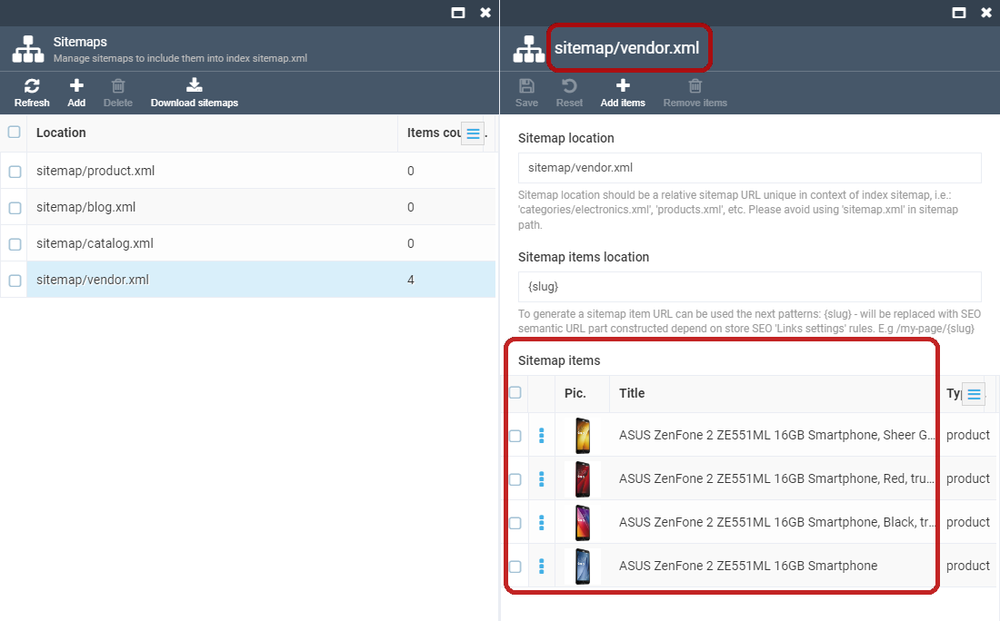

# Overview

Sitemaps are an easy way for webmasters to inform search engines about the pages on their sites that are available for crawling. In its simplest form, a Sitemap is an XML file that lists URLs for a site along with additional metadata about each URL (when it was last updated, how often it usually changes and how important it is, relative to other URLs in the site) so that search engines could crawl the site more intelligently.

Web crawlers usually discover pages from links within the site and from other sites. Sitemaps supplement this data to allow crawlers, that support Sitemaps, to pick up all URLs in the Sitemap and learn about those URLs using the associated metadata. Using the Sitemap protocol does not guarantee that web pages are included in search engines, but provides hints for web crawlers to do a better job while crawling your site.

Virto Commerce provides multiple sitemap files, each sitemap file must include no more than 10,000 URLs (by default, maximum value - 50000 URLs) and must be no larger than 50MB (52,428,800 bytes). Each sitemap file will be placed in a sitemap index file "sitemap.xml". In case of sitemap file has more than maximum records number, it would be separated to several sitemap files, i.e.: "products.xml" sitemap file with 15000 records would be transformed to "products--1.xml" (10000 records) and "products--2.xml" (5000 records). Each of these partial sitemap files would be included in sitemap index file too.

## Scenarios

### Configure Sitemaps

In order to configure the store sitemaps navigate to More > 'Stores' > select the store and click the 'Sitemaps' widget. The 'Sitemaps' blade contain a list of sitemaps to be included into the sitemap index file.


### Add a New Sitemap to Store

In order to add a new sitemap, click "Add sitemap" toolbar button. The blade "New sitemap" will appear. Each sitemap contains 2 required parameters: Sitemap location and Sitemap items location, and a list of items to be included in the sitemap file.


1. Sitemap location parameter represents the location of the sitemap file and the requirements to this parameter are the same as to a relative URL. The sitemap location value must end with '.xml' extension. Using of 'sitemap.xml' location is prohibited since this is the reserved filename for sitemap index file. Some good examples for parameter value: products.xml, sitemap/vendors.xml;

1. Sitemap items location parameter represents the sitemap items location. Since this parameter is a second part of sitemap location - the requirements to its value are the same as to relative URLs. The value of this parameter can be constructed with patterns (will be replaced with language code of corresponding SEO info or with default store language if sitemap item had no SEO info; i.e.: en-US, en-GB, etc.) and (will be replaced with corresponding SEO semantic URL or sitemap item ID if sitemap item had no SEO infos).

### Add Sitemap Items

1. Select a sitemap from the list and click the 'Add items' button located on the toolbar;
1. Each sitemap contains a list of sitemap items of different types:

   1. Catalog sitemap items are like products and categories. For each category, there will be performed a catalog search for subcategories and products; so, category sitemap items can be called a 'formal sitemap item' - the number of real sitemap items for category sitemap item can be much more than 1. For each category and product there will be added a different URL record for SEO sematic URL in corresponding language;
   1. Vendor sitemap items. For each vendor, there will be added a different URL record for SEO sematic URL in corresponding language;
   1. Custom sitemap items. If you wish to include a custom URL in a sitemap, set its absolute URL here.
1. Select the item and add it to the sitemap;
1. The selected item will be add to the sitemap blade.



### Use Cases

1. Get a zip-package of sitemaps by clicking "Download sitemaps" button on "Sitemaps" blade and place the contents of it to the store theme asset folder manually;
1. Get the sitemaps schema and generate;sitemap index file and sitemap files on-the-fly by API call (recommended for small stores, where the number of catalog items/vendors is less than 500);
1. Schedule and configure a recurring job to generate the sitemap files (recommended for big stores since catalog/vendor search is a long-term process and sitemaps generation may require tens of minutes).

## API calls

```
// Get a collection of sitemap location URLs

[GET] api/sitemaps/schema?storeId=...
```

```
// Get a stream contains a sitemap file XML data

[GET] api/sitemaps/generate?storeId=...&baseUrl=...&sitemapUrl=...
```

## Installation

Installing the module:
1. Automatically: in VC Manager go to More -> Modules -> Sitemaps module -> Install;

1. Manually: download module zip package from https://github.com/VirtoCommerce/vc-module-sitemaps/releases. In VC Manager go to More -> Modules -> Advanced -> upload module package -> Install.

## Settings

Virto Commerce Sitemaps module has several settings, each of them influences the sitemap XML generation process. The settings are grouped into sections.

### General settings

1. Records limit (default value: **10000**) - sets the maximum number of URLs record per sitemap file;
1. ilename separator (default value: **--**) - sets the sitemap location separator in case of sitemap items number exceeds the **Records limit** parameter value (i.e.: "products.xml" -> "products--1.xml" and "products--2.xml");
1. Search bunch size (default value: **1000**) - this parameter is using in long-term search processes (i.e. catalog search) to divide search requests and sets the search request bunch size parameter
1. Export/Import description (default value: **Export/Import sitemaps with all sitemap items**) - sets the description for platform export/import process.

### Blog links

1. Blog page priority sets the value of the sitemap **&lt;priority&gt;** parameter of static pages and blogs;
2. Blog page update frequency sets the value of the sitemap **&lt;changefreq&gt;** parameter of static pages and blogs.

### Category links

1. Category page priority (default value: **0.7**) - sets the value of the sitemap **&lt;priority&gt;** parameter of catalog categories pages;
2. Category page update frequency (default value: **weekly**) - sets the value of the sitemap **&lt;changefreq&gt;** parameter of catalog categories pages.

### Product links

1. Product page priority (default value: **1.0**) - sets the value of the sitemap **&lt;priority&gt;** parameter of catalog products pages;
2. Product page update frequency (default value: **daily**) - sets the value of the sitemap **&lt;changefreq&gt;** parameter of catalog products pages.

These values can be set at the module level.
Go to Settings and click the "Sitemap" module then click the section "Sitemaps".


The values can also be set at the store level.
Go to "Stores", select the desired store, click "Settings". Please note that the priority and update frequency settings at the store level have a higher priority and they will override the settings specified at the module level.


