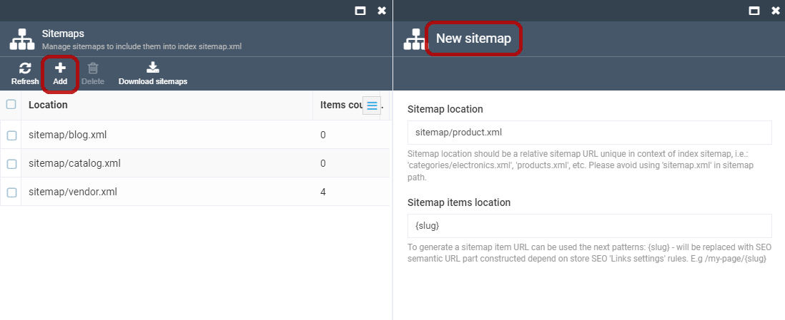

# Overview

Sitemaps are an easy way for webmasters to inform search engines about the pages on their websites that are available for crawling. In its simplest form, a Sitemap is an XML file that lists URLs for a website along with additional metadata about each URL, i.e. when it was last updated, how often it usually gets changed, and how important it is in terms of other URLs on the website; thus, the search engines can crawl the website in a more intelligent way.

Web crawlers usually discover pages from links within the website, as well as from other websites. Sitemaps supplement this data to allow crawlers, that support Sitemaps, to pick up all URLs in the Sitemap and learn about those URLs using the associated metadata. Using the Sitemap protocol does not guarantee that web pages are included in search engines; however, it provides hints for web crawlers to do a better job while crawling your website.

Virto Commerce provides multiple sitemap files. Each sitemap file must include no more than 10,000 URLs (by default, the maximum value is 50,000 URLs) and must not be larger than 50MB (52,428,800 bytes). Each sitemap file will be placed in the sitemap index file, `sitemap.xml`. In case the number of records exceeds the maximum, the file will be split into multiple ones, i.e.: the `products.xml` sitemap file with 15,000 records will be transformed into `products--1.xml` (10,000 records) and `products--2.xml` (5,000 records). Each of these partial sitemap files will be included in the sitemap index file, too.

## Scenarios

### Configuring Sitemaps

In order to configure the store sitemaps, navigate to *More > Stores*, select the store and click the *Sitemaps* widget. On the *Sitemaps* screen, you will see a list of sitemaps to be included into the sitemap index file.


### Adding a New Sitemap to Store

In order to add a new sitemap, click the *Add sitemap* toolbar button. The *New sitemap* screen will show up. Each sitemap contains 2 required parameters: *Sitemap location* and *Sitemap item location*, as well as a list of items to be included into the sitemap file.



1. The Sitemap location parameter represents the location of the sitemap file; the requirements to this parameter are the same as to the respective URL. The sitemap location value must end with `.xml` extension. Ypu cannot use `sitemap.xml` as a location as this is the reserved filename for the sitemap index file. Some good examples may include `products.xml` or `sitemap/vendors.xml`.

1. Sitemap item location is where the sitemap items are going to be placed. Since this parameter is a second part of the sitemap location, the requirements to its value are the same as to the respective URLs. The value of this parameter can be constructed with patterns (will be replaced with language code of the relevant SEO info or with the default store language if the sitemap item has no SEO info, i.e.: en-US, en-GB, etc.).

### Adding Sitemap Items

1. Select a sitemap from the list and click the *Add items* button located on the toolbar.
1. Each sitemap contains a list of sitemap items of different types:

   + Catalog sitemap items are like products and categories. For each category, a catalog search for subcategories and products will be performed. This means category sitemap items can be called a 'formal sitemap item', as the number of real sitemap items for a category sitemap item can be much more than 1. For each category and product, a different URL record for SEO sematic URL will be added in the relevant language.
   + Vendor sitemap items. For each vendor, a different URL record for SEO sematic URL will be added in the relevant language.
   + Custom sitemap items. If you want to include a custom URL in a sitemap, set its absolute URL here.
1. Select the item and add it to the sitemap.
1. The selected item will be added to the *Sitemap* screen.


### Use Cases

1. Get a zip package of sitemaps by clicking the *Download sitemaps* button on the *Sitemaps* screen and place the content of it to the store theme asset folder manually.
1. Get the sitemap schema and generate the sitemap index file and sitemap files on-the-fly by an API call (recommended for small stores where the number of catalog items or vendors is less than 500).
1. Schedule and configure a recurring job to generate sitemap files (recommended for large stores, as catalog or vendor search is a long-term process and sitemap generation may require 30 minutes or more.

## API Calls

```
// Get a collection of sitemap location URLs

[GET] api/sitemaps/schema?storeId=...
```

```
// Get a stream containing sitemap file XML data

[GET] api/sitemaps/generate?storeId=...&baseUrl=...&sitemapUrl=...
```

## Installation

Installing the module:
1. Automatically: In VC Manager, go to *More -> Modules -> Sitemaps module -> Install*

1. Manually: Download the module zip package from [here](https://github.com/VirtoCommerce/vc-module-sitemaps/releases). In VC Manager, go to *More -> Modules -> Advanced*, then upload the module package and hit *Install*.

## Settings

The Virto Commerce Sitemaps module has multiple settings, each of them influencing the sitemap XML generation process. The settings are grouped into sections.

### General Settings

1. Record limit (default value: **10000**): Sets the maximum number of URL records per sitemap file.
1. Filename separator (default value: **--**): Sets the sitemap location separator in case the sitemap item number exceeds the *Record limit* parameter value (i.e.: `products.xml` -> `products--1.xml` and `products--2.xml`).
1. Search bunch size (default value: **1000**): This parameter is used in the long-term search processes (i.e. catalog search) to split search requests, and sets the search request bunch size parameter.
1. Export/Import description (default value: **Export/Import sitemaps with all sitemap items**): Sets the description for the platform export/import process.

### Blog Links

1. Blog page priority sets the value of the sitemap **&lt;priority&gt;** parameter of static pages and blogs.
2. Blog page update frequency sets the value of the sitemap **&lt;changefreq&gt;** parameter of static pages and blogs.

### Category Links

1. Category page priority (default value: **0.7**): Sets the value of the sitemap **&lt;priority&gt;** parameter for catalog category pages.
2. Category page update frequency (default value: **weekly**): Sets the value of the sitemap **&lt;changefreq&gt;** parameter for catalog category pages.

### Product Links

1. Product page priority (default value: **1.0**): Sets the value of the sitemap **&lt;priority&gt;** parameter for catalog product pages.
2. Product page update frequency (default value: **daily**): Sets the value of the sitemap **&lt;changefreq&gt;** parameter for catalog product pages.

These values can be set at the module level. To modify them, go to *Settings* and click the *Sitemap* module, then navigate to the *Sitemaps* section.


The values can also be set at the store level. For that, go to *Stores*, select the desired store, and click *Settings*.

> Please note: The priority and update frequency settings at the store level have a higher priority, which means they will override the settings specified at the module level.


